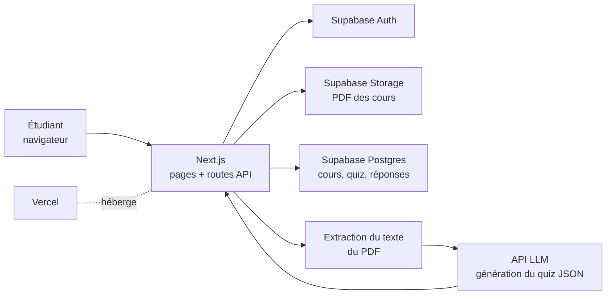
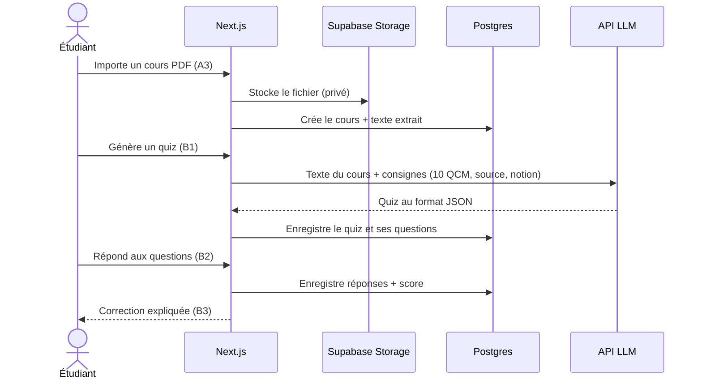
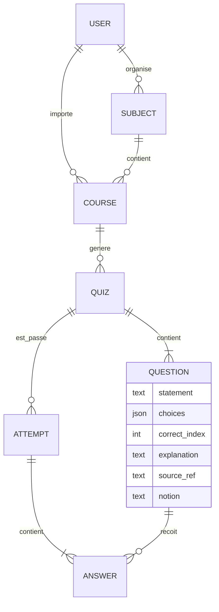

# Architecture du MVP

> Proposition du Tech Lead, à formaliser en ADR-004 pendant le sprint 1.

## Stack

| Brique | Choix | Pourquoi |
|---|---|---|
| Front + API | Next.js (TypeScript) | Un seul projet pour l'interface et les routes serveur |
| Auth, base, stockage | Supabase (Auth, Postgres, Storage) | Offre gratuite, auth prête à l'emploi, règles d'accès par utilisateur (RLS) |
| Génération de quiz | API d'un modèle de langage, sortie JSON structurée | Isolée derrière une interface pour pouvoir changer de fournisseur |
| Hébergement | Vercel | Déploiement automatique et URL de prévisualisation par PR |

## Vue d'ensemble

## Parcours principal : du PDF au quiz

## Modèle de données (première version)

## Points d'attention

- **Secrets :** clés Supabase et LLM uniquement dans les variables d'environnement Vercel / `.env.local` (jamais commitées, le repo est public).
- **Données :** chaque cours est privé à son utilisateur (politiques RLS sur toutes les tables).
- **Qualité IA :** chaque question garde sa source (`source_ref`) et sa notion (`notion`), utilisées par la correction (B3) et les notions à revoir (C2).
